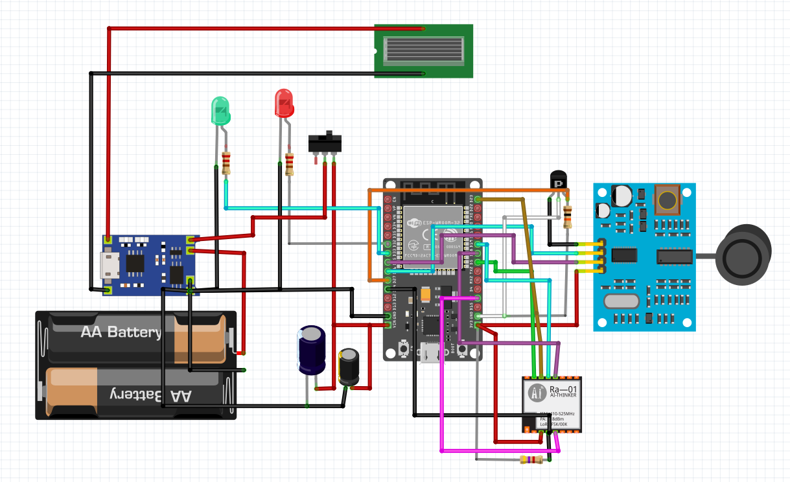
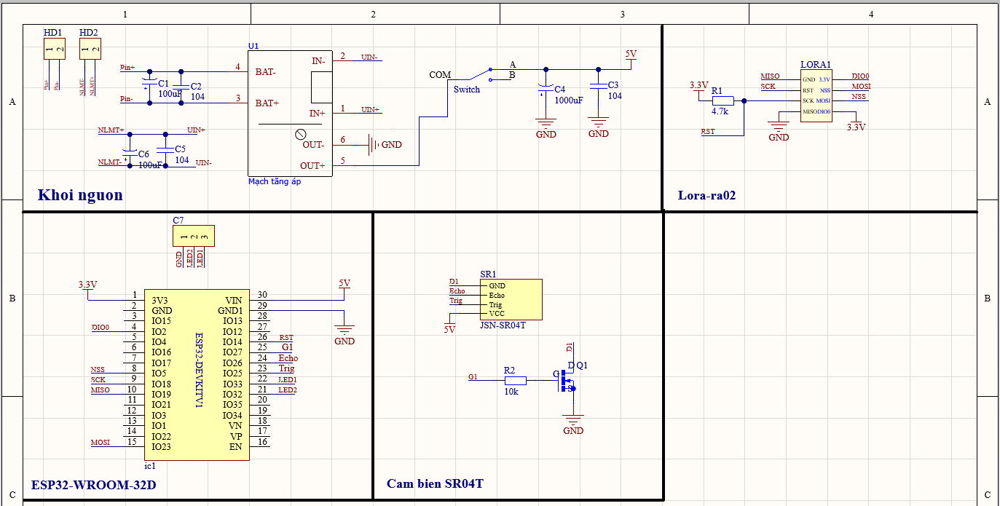
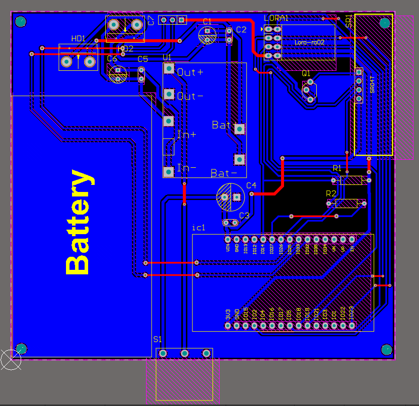
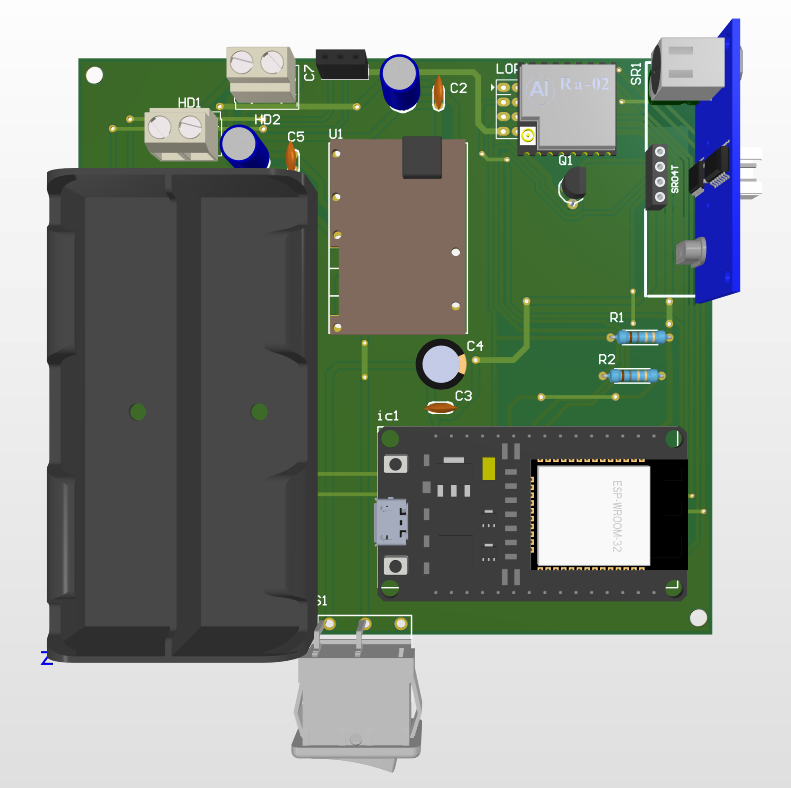
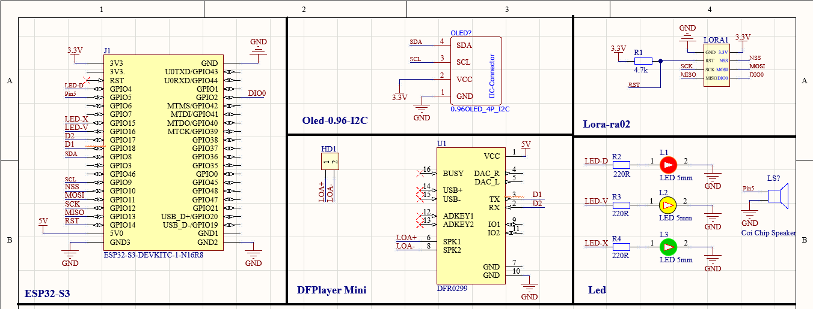
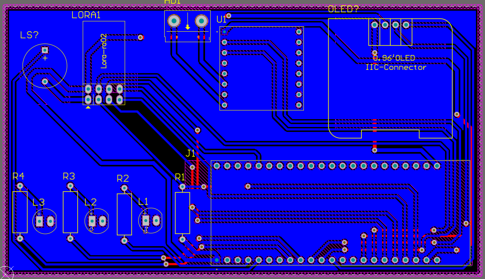
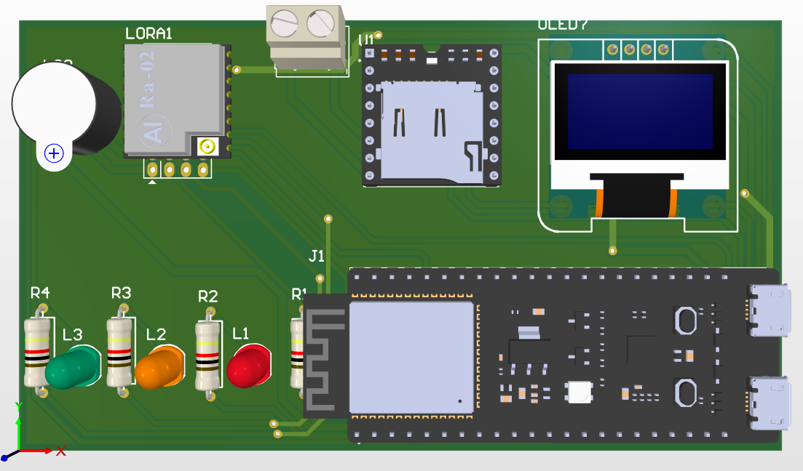
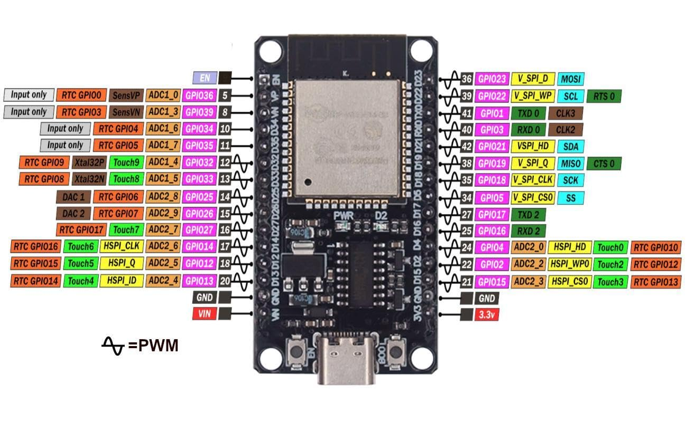

# 🌊 Smart Flood Warning System

A project to design and build a smart flood warning system model using ESP32 microcontrollers and LoRa wireless communication.

---

## 🎯 **Objective**

To build a system capable of real-time water level measurement and delivering timely warnings to residents through various methods (LEDs, speakers, Telegram messages) to minimize flood-related damages.

---

## ⚙️ **How It Works**

The system comprises two main stations:

1.  **Measuring Station:**
    *   Uses an ESP32 and an ultrasonic sensor to continuously measure the water level.
    *   Transmits the data to the Control Station via LoRa wireless communication.

2.  **Control Station:**
    *   Uses an ESP32-S3 to receive data from the Measuring Station.
    *   Displays warning levels on an LCD and through status LEDs.
    *   Activates a loudspeaker to play a pre-recorded warning.
    *   Sends alert notifications to a configured Telegram channel.
    *   Publishes data to HiveMQ cloud broker via MQTT protocol.
    *   Integrates with Node-RED for data processing and web dashboard.
    *   Uses ngrok for secure public access to the monitoring interface.

---

## 🖼️ **System Diagrams**

### Block Diagrams
| Measuring Station Block Diagram | Control Station Block Diagram |
| :-----------------------------: | :---------------------------: |
|  |  |

### Measuring Station (Trạm Đo)
| Schematic | PCB Layout | 3D View |
| :---: | :---: | :---: |
|  |  |  |

### Control Station (Trạm Kiểm Soát)
| Schematic | PCB Layout | 3D View |
| :---: | :---: | :---: |
|  |  |  |

### Pinout Diagrams
| ESP32-D Pinout | ESP32-S3 DevKitC-1 Pinout |
| :---: | :---: |
|  |  |

---

## 📱 **Product Images**

### Physical Implementation
| Measuring Station | Control Station |
| :---------------: | :-------------: |
|  |  |

---

## 🌐 **Web Server & Monitoring**

The system integrates with a web-based monitoring solution using MQTT protocol:

### Architecture
- **MQTT Broker:** HiveMQ Cloud
- **Data Processing:** Node-RED for data flow and visualization
- **Public Access:** ngrok for secure tunneling and external access
- **Real-time Dashboard:** Web interface for monitoring water levels and system status

### Web Interface
| Web Server Dashboard |
| :------------------: |
|  |

### Telegram Integration
| Telegram Bot Alerts |
| :-----------------: |
|  |

---

## 📌 **Hardware Components**

### Measuring Station

| Component | Details |
| :--- | :--- |
| **Microcontroller** | ESP32-WROOM-32D |
| **Sensor** | Waterproof Ultrasonic Sensor SR04T |
| **Communication** | LoRa Ra-02 (SX1278) |
| **Power** | 2 x 18650 Batteries, TP4056 Charging Module |
| **Other** | MOSFET 2N7000, Capacitors, Resistors, LEDs, Switch |

### Control Station

| Component | Details |
| :--- | :--- |
| **Microcontroller** | ESP32-S3 |
| **Communication** | LoRa Ra-02 (SX1278) |
| **Display** | LCD with I2C, 3x Status LEDs |
| **Audio** | Loudspeaker for audio alerts |
| **Connectivity** | Wi-Fi for MQTT communication to HiveMQ |
| **Other** | Resistors |

---

## 💻 **Source Code** (Use ESP-IDF)

*   **Measuring Station:** `Code/Code measuring station/Tram_do`
*   **Control Station:** `Code/Code main station/Tram_kiem_soat`

---

## 🛠️ **Setup and Usage**

*(You can add detailed instructions here on how to compile and flash the code to the ESP32s, as well as how to configure Wi-Fi and the Telegram token for the control station.)*